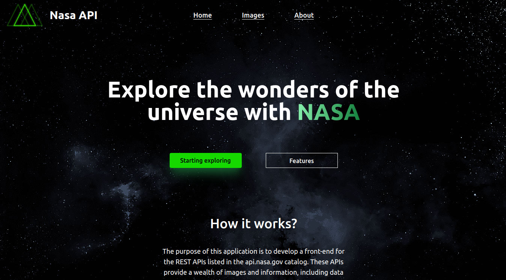

# NASA API

## Overview

NASA APOD Viewer is a modern web application built using Vue.js, Axios, and Tailwind CSS to provide a seamless and engaging user experience. This app allows users to explore NASA's Astronomy Picture of the Day (APOD) from the API. It handles data efficiently by caching requests and only updates data once a day.




## Features

- **Dynamic Content:** Displays images and videos from NASA's APOD.
- **Responsive Design:** Styled with Tailwind CSS for a responsive and aesthetically pleasing interface.
- **Local Data Storage:** Caches data to minimize unnecessary API calls.
- **Routing:** Uses Vue Router for navigation between different views.

## Technologies

- **Vue.js:** A progressive JavaScript framework for building user interfaces.
- **Axios:** For making HTTP requests to the NASA API.
- **Tailwind CSS:** A utility-first CSS framework for custom designs.
- **Vue Router:** For navigation and routing within the app.

## Installation

To get started with this project, clone the repository and install the dependencies:

```bash
git clone https://github.com/your-username/nasa-apod-viewer.git
cd nasa-apod-viewer
npm install
```

## Configuration

1. **API Key:** Obtain an API key from NASA's API portal and add it to your environment variables. Create a `.env` file in the root of your project and add:

   ```env
   VITE_API_KEY=your_nasa_api_key
   ```

2. **Start the Development Server:**

   ```bash
   npm run dev
   ```

   The app should now be running at `http://localhost:3000`.

## Usage

- **Homepage:** Shows a list of APODs with images or videos.
- **Detail View:** Clicking on "Check it out" will navigate to the detail view of the selected APOD.

## Code Structure

- **`src/components/`**: Contains reusable Vue components.
- **`src/views/`**: Contains Vue components for different views (e.g., homepage, details).
- **`src/router/index.js`**: Configures routing for the application.
- **`src/assets/`**: Contains static assets like images and styles.
- **`src/api/`**: Contains configuration and API handling files.

## Contributing

Contributions are welcome! Please fork the repository and submit a pull request.

1. Fork the repository.
2. Create a feature branch (`git checkout -b feature-branch`).
3. Commit your changes (`git commit -am 'Add new feature'`).
4. Push to the branch (`git push origin feature-branch`).
5. Create a new Pull Request.

